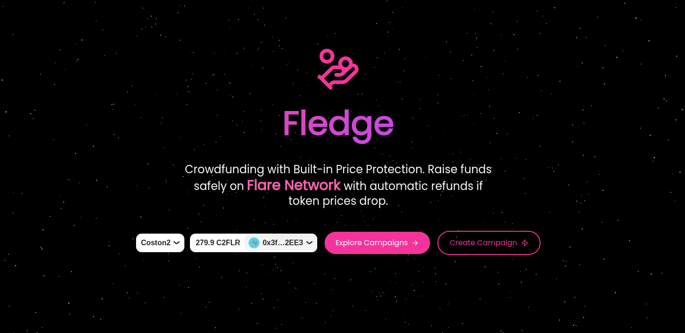
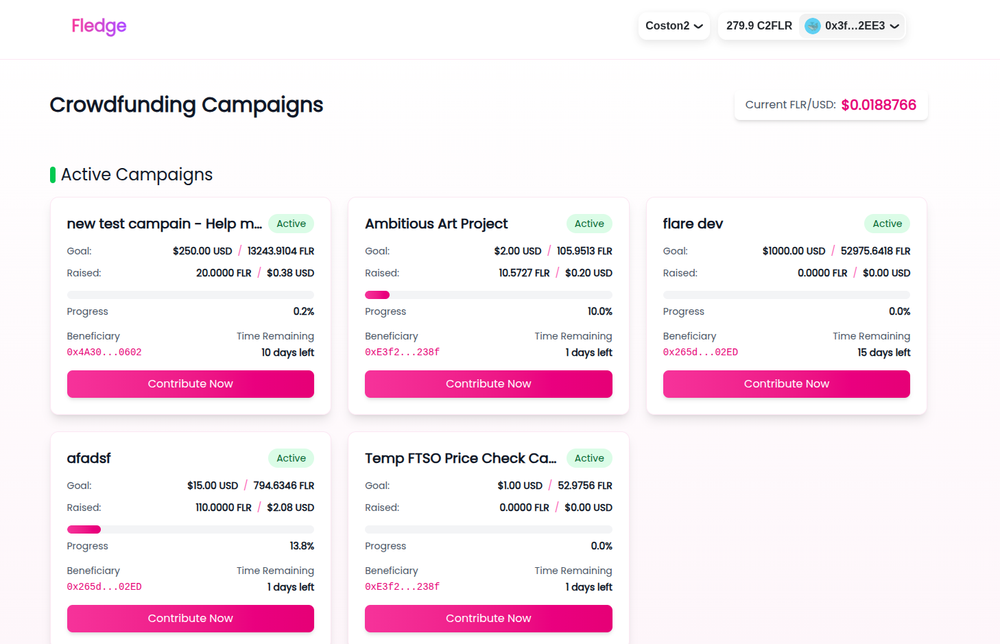

# Fledge - Secure Crowdfunding on Flare Network



Fledge is a decentralized crowdfunding platform built on the Flare Network that provides built-in price protection for contributors. Our platform ensures that your investments are safe even if token prices drop before the funding goal is reached.

## 🌟 Key Features

- **Price Protection**: Automatic refunds if FLR price drops before funding goal is reached
- **Secure Campaigns**: Built-in price protection for all contributors
- **Real-time Tracking**: Monitor campaign progress and price movements
- **User-Friendly Interface**: Intuitive design for both campaign creators and contributors



## 🔬 Technical Architecture

### Smart Contract System

The platform consists of two main smart contracts:

1. **CrowdfundingFactory**
   - Creates and manages individual campaign contracts
   - Maintains a registry of all campaigns
   - Handles campaign creation and contribution routing
   - Provides pagination and filtering for campaign discovery

2. **CrowdfundingCampaign**
   - Manages individual campaign logic
   - Integrates with Flare's FTSO (Flare Time Series Oracle) for real-time price feeds
   - Implements price protection mechanism
   - Handles contributions and fund distribution

### FTSO Integration

The platform leverages Flare's FTSO system for reliable price feeds:

```solidity
function getFlrUsdPrice() public returns (uint256 price, int8 decimals, uint64 timestamp) {
    FtsoV2Interface ftsoV2 = ContractRegistry.getFtsoV2();
    return ftsoV2.getFeedById(FLR_USD_ID);
}
```

Key features of the FTSO integration:
- Real-time FLR/USD price updates
- High accuracy through Flare's decentralized oracle network
- Automatic price protection checks
- Transparent price verification

### Price Protection Mechanism

The system implements price protection through:
1. Continuous monitoring of FLR/USD price via FTSO
2. Automatic goal achievement checks based on current price
3. Secure fund distribution only when price conditions are met
4. Transparent campaign finalization process

## 🚀 Getting Started

### Prerequisites
- Node.js (v16 or higher)
- npm or yarn
- A Web3 wallet (MetaMask, Rainbow, etc.)

### Installation

1. Clone the repository:
```bash
git clone https://github.com/yourusername/fledge.git
cd fledge/frontend
```

2. Install dependencies:
```bash
npm install
```

3. Start the development server:
```bash
npm run dev
```

4. Open [http://localhost:3000](http://localhost:3000) in your browser

## 💡 Features in Detail

### For Campaign Creators
- Create campaigns with customizable funding goals
- Set campaign duration and beneficiary address
- Monitor campaign progress in real-time
- Automatic price protection for contributors

### For Contributors
- Browse active campaigns
- Contribute with built-in price protection
- Track campaign progress and price movements
- Automatic refunds if price protection is triggered

## 🛠️ Tech Stack

- **Frontend**: Next.js, React, TailwindCSS
- **Web3**: RainbowKit, wagmi
- **Blockchain**: Flare Network (Coston2 testnet & Mainnet)
- **Styling**: Framer Motion for animations

## 🔗 Useful Links

- [Flare Network Documentation](https://docs.flare.network)
- [RainbowKit Documentation](https://rainbowkit.com)
- [wagmi Documentation](https://wagmi.sh)
- [Next.js Documentation](https://nextjs.org/docs)


## 📝 License

This project is licensed under the MIT License - see the [LICENSE](LICENSE) file for details.

## 🤝 Contributing

Contributions are welcome! Please feel free to submit a Pull Request.
